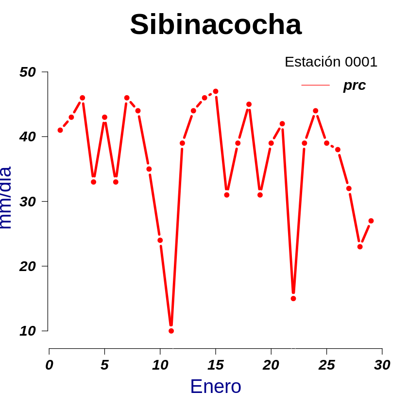
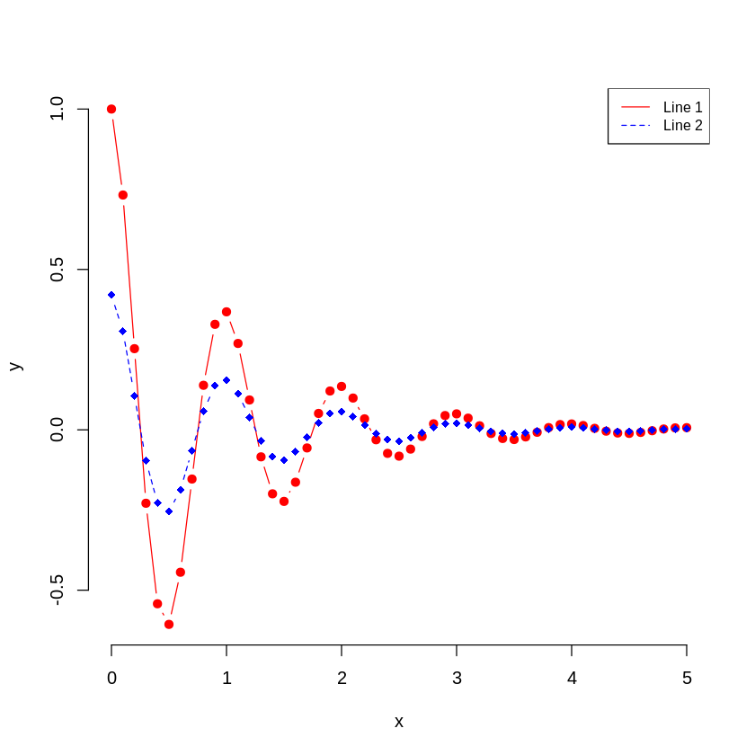
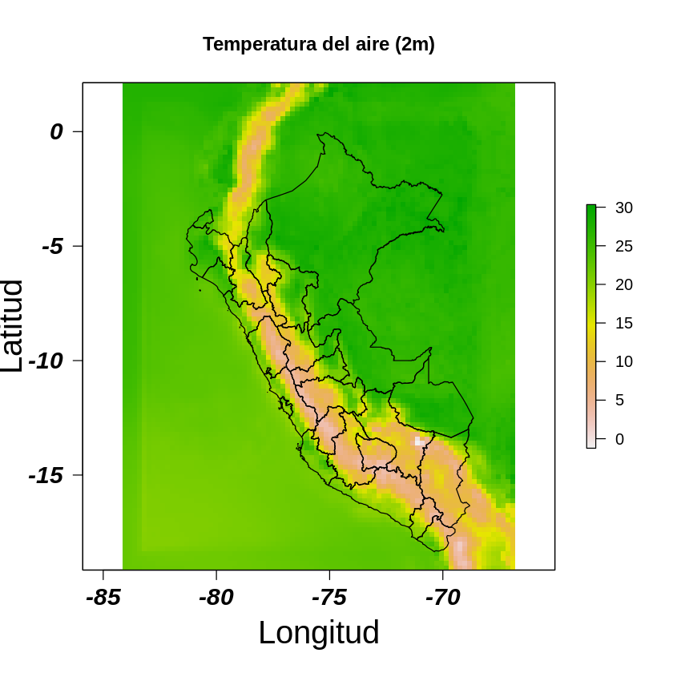

# R para Geociencias: Aplicado a la hidrología 
### Por: Víctor Rojas

* [01 Introduction]
* [02 Tipo de variables](https://github.com/vrrp/R4geociencias/blob/master/2-Tipo_variables.ipynb)
* [03 Estructura y control de datos](https://github.com/vrrp/R4geociencias/blob/master/3-Estructura_control_datos.ipynb)
* [04 Contros de flujos](https://github.com/vrrp/R4geociencias/blob/master/4-control_de_flujos.ipynb)
* [05 Control de flujos en matrices de 2D y 3D](https://github.com/vrrp/R4geociencias/blob/master/5-control_flujos_matrices_2D_3D.ipynb)
* [06 Funciones](https://github.com/vrrp/R4geociencias/blob/master/6-funciones.ipynb)
* [07 Lectura de archivos ASCII](https://github.com/vrrp/R4geociencias/blob/master/7-lectura_de_archivos_ascii.ipynb)

   
      

* [08 Lectura de archivos netCDF y elaboración de mapas](https://github.com/vrrp/R4geociencias/blob/master/8-leer_archivos_nc_y_generar_mapas.ipynb)

   
      

